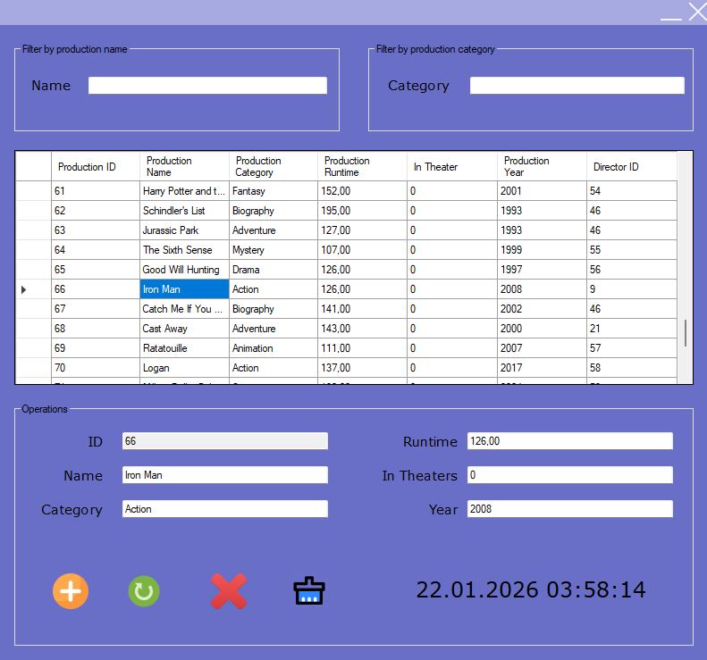

# 🎬 Entertainment Hub - Production Management System

A comprehensive Windows Forms application for managing entertainment records, including movies, TV series, and other productions. Built with **C#** and **Entity Framework**, featuring a robust N-Layered architecture.

---

## ✨ Features

- 🔍 **Advanced Filtering**: 
    - **Real-time Search**: Filter productions instantly by Name or Category.
    - **Combined Logic**: Smart filtering capabilities that allow searching by both name and category simultaneously.
- 🛠️ **CRUD Operations**: 
    - **Create**: Add new productions with details like Runtime, Year, and Theater status.
    - **Update**: Seamlessly modify existing records by selecting them from the grid.
    - **Delete**: Remove obsolete records with a single click.
    - **Clear Controls**: One-button reset for all input fields.
- 🏗️ **Robust Architecture**: Built using a professional **N-Layered Architecture** (Entities, DataAccess, Business, UI) ensuring maintainability and scalability.
- 💾 **Entity Framework**: Utilizes modern ORM standard for efficient database interactions.
- 🕒 **Live Dashboard**: Features a real-time digital clock and a dynamic DataGridView for data visualization.

## 🛠️ Technologies

- **.NET Framework**
- **Windows Forms (WinForms)**
- **Entity Framework 6**
- **C#**
- **SQL Server (LocalDB/MSSQL)**

## 📋 Requirements

- Windows Operating System
- .NET Framework 4.7.2 or higher
- Visual Studio 2019/2022 (for development)
- SQL Server

## 🚀 Installation & Setup

1. **Clone the Repository**
   ```bash
   git clone https://github.com/Kaaner4mir/entertainment-hub.git
   cd entertainment-hub
   ```

2. **Database Configuration**
   - The project uses Entity Framework Code First (or Database First depending on setup). Ensure your connection string in `App.config` points to your local SQL Server instance.

3. **Build the Project**
   - Open `EntertainmentHub.slnx` in Visual Studio.
   - Restore NuGet packages.
   - Press **F5** to build and run the application.

## 📖 Usage

### Managing Productions
1. **Adding**: Fill in the "Operations" form fields (Name, Category, Runtime, etc.) and click the **Add** (+) button.
2. **Updating**: Click any row in the list to populate the fields, edit the information, and click **Update**.
3. **Deleting**: Select a row and click **Delete** to remove it.

### Filtering
- Type in the **Name** box to filter by production title.
- Type in the **Category** box to filter by genre.
- Use both to find specific items (e.g., "Action" movies with "Man" in the title).

## � Project Structure

```
EntertainmentHub/
├── 📁 Assets/                     # Application resources & screenshots
├── 📁 EntertainmentHub.Business/  # Business Logic Layer (Managers & Services)
├── 📁 EntertainmentHub.DataAccess/# Data Access Layer (EF Context & Repositories)
├── 📁 EntertainmentHub.Entities/  # Domain Entities (Data Models)
├── 📁 EntertainmentHub.FormsUI/   # Presentation Layer (Windows Forms)
├── 📄 EntertainmentHub.slnx       # Solution File
├── 📄 LICENSE                     # MIT License
└── 📄 README.md                   # Project Documentation
```

## 🤝 Contributing

Contributions are welcome! Please follow these steps:

1. Fork this repository
2. Create a new branch (`git checkout -b feature/NewFeature`)
3. Commit your changes (`git commit -m 'Add new feature'`)
4. Push your branch (`git push origin feature/NewFeature`)
5. Create a Pull Request

## 👤 Author

**Kaaner4mir**

- GitHub: [@Kaaner4mir](https://github.com/Kaaner4mir)

## 📝 License

This project is licensed under the MIT License. See the `LICENSE` file for details.

---

## 📸 Screenshots

### App Preview

